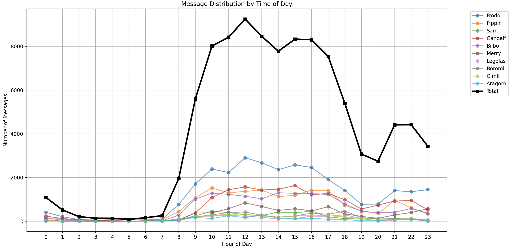
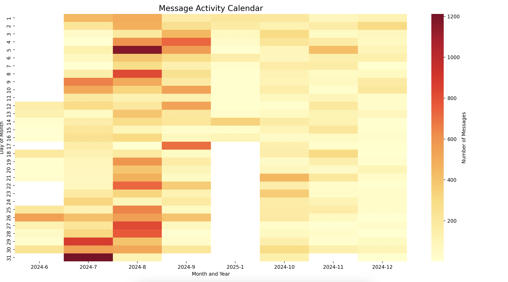
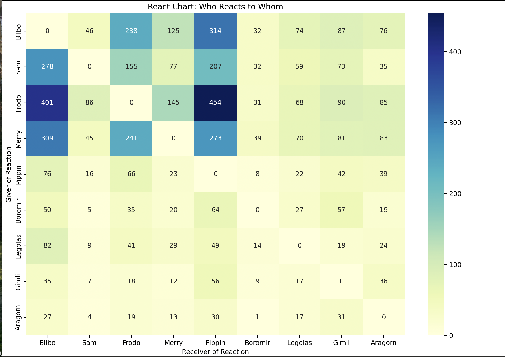
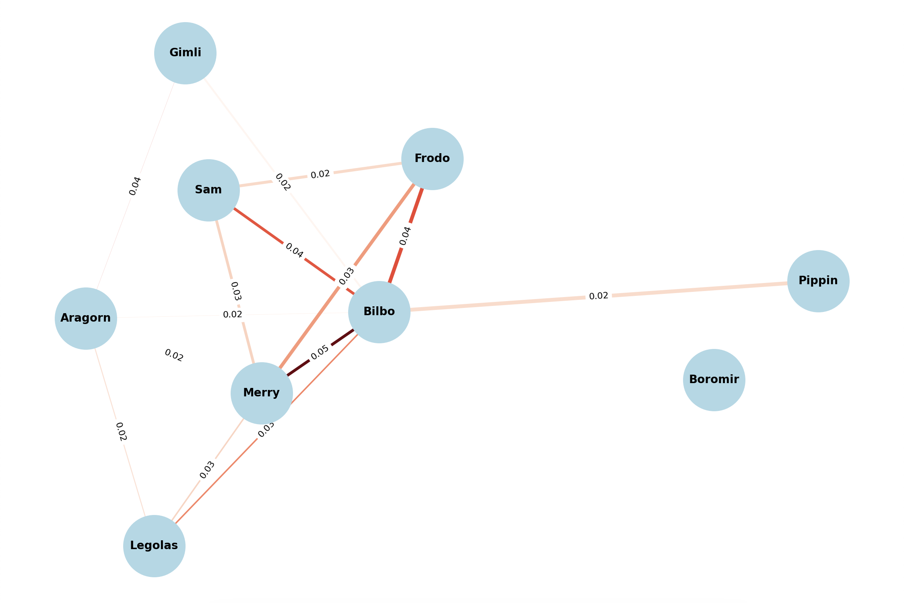

## imessage-data
#### Introduction
A Python script for analyzing iMessage chat data, focusing on message patterns, reactions, and participant engagement. The script processes raw iMessage exports to extract temporal patterns, word frequencies, reaction networks, and name mentions.
The analysis includes message time distributions, reaction heatmaps, activity calendars, and a sophisticated reaction probability network visualization. Key metrics calculated include message counts per participant, reaction frequencies, and name mention analysis. 
The script uses beta distributions to estimate reaction probabilities and includes confidence intervals in the network visualization.
Visualization outputs include hourly message distribution plots, reaction heatmaps showing who reacts to whom, activity calendars displaying message frequency over time, and a network graph showing the strength of reaction relationships between participants.  
#### Results

For privacy's sake I'm not including the dataset or any real names. 

This chart buckets all messages into each hour of the day and then logs the cumulative sums.  

This shows which days the group chat was most active. 

This shows the raw counts of who was most likely to react to whom.  

This shows the probability of two users reacting to each other.  This was hardest to calculate as you had to filter some low-frequency reactors and users as it would've weighted the chart too much.  Boromir, in particular is rather hurt by this. 

#### Conclusion
The most informative part of this for me was the important of cleaning and structuring data in a sensible way.  
